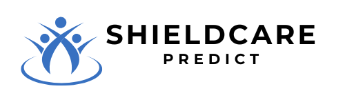

# ShieldCare Predict: Predictive Health Insurance Model




ShieldCare Predict is a predictive analytics project aimed at estimating health insurance premiums based on customer-specific factors such as age, smoking habits, BMI, genetic risks, and medical history. By leveraging data science techniques, the project ensures efficient, accurate, and fair premium estimations, enhancing customer experience and optimizing insurance processes.

## Objectives

1. **Community Benefit:** Provide personalized and fair health insurance premium estimations, empowering customers with transparency and fostering trust in insurance processes.
2. **Accuracy:** Develop a predictive model with an R² score of 0.85 or higher and ensure that at least 65% of prediction errors have a percentage difference of less than 10% between predicted and actual values, as outlined in the project report.
3. **Accessibility:** Make the model accessible via a web application deployed on a cloud platform, enabling access from anywhere.
4. **Usability:** Build an interactive application using Flask for backend and Materialize for frontend to provide underwriters with seamless predictions.
5. **Efficiency:** Implement infrastructure for straight-through processing (STP) to automate the insurance quote generation process.

## Features

* **Data Collection and Preprocessing:** Handling labeled datasets, cleaning, and performing exploratory data analysis (EDA).
* **Model Development:** Training, optimizing, and selecting the best machine learning model for premium predictions.
* **Deployment:** Deploying the model on Render to ensure scalability and security for real-world usage.
* **Interactive Application:** Enabling seamless user interaction via a web interface.
* **Testing and Validation:** Using real-world data to rigorously validate the model's reliability.
* **Documentation and Training:** Comprehensive resources and training for insurance underwriters.

## Methodology

1. **Data Preparation:**
   * Data collection and cleaning.
   * Handling missing values and inconsistencies.
   * Splitting the dataset into training and testing subsets.
   * Feature scaling for uniformity.
2. **Exploratory Data Analysis (EDA):**
   * Statistical analysis and visualization to understand data distributions.
   * Handling outliers and engineering new features.
3. **Model Development:**
   * Training and testing models such as Linear Regression, Ridge Regression, Support Vector Regression (SVR), and Random Forest.
   * Hyperparameter tuning using GridSearchCV.
   * Selecting Random Forest as the best-performing model.
4. **Deployment:**
   * Building an intuitive web application using Flask for backend and Materialize for frontend.
   * Deploying the model using Render for cloud hosting.
5. **Validation:**
   * Testing with real-world insurance data.
   * Measuring key metrics like R², RMSE, prediction latency, and uptime.
6. **Documentation:**
   * Detailed guides for usage and maintenance.
   * Training sessions for end-users.

## Technologies Used

* **Programming Languages:** Python
* **Libraries and Frameworks:** Pandas, NumPy, Scikit-learn, Matplotlib
* **Backend Framework:** Flask
* **Frontend Framework:** Materialize
* **Cloud Platform:** Render (for deployment)
* **Tools:** Pickle for model serialization, GridSearchCV for hyperparameter tuning

## Results

* **Model Performance:** Random Forest model achieved an R² score of 87.9% and RMSE of 0.348 on the test set.
* **System Metrics:** Prediction latency under 2 seconds, uptime of 99.8%, and a usability score of 4.8/5.
* **Deployment:** A functional, scalable, and secure system accessible to Shield Insurance’s underwriters and clients.

## How to Use

You can explore the live version of the application by visiting [ShieldCare Predict](https://shieldcare-predict.onrender.com).

If you'd like to run the application locally:

1. **Clone the repository:**
   ```bash
   git clone https://github.com/Khushboo-Mittal/ShieldCare-Predict.git
   ```

2. **Navigate to the project directory:**
   ```bash
   cd ShieldCare-Predict
   ```

3. **Install the required dependencies:**
   ```bash
   pip install -r requirements.txt
   ```

4. **Run the application:**
   ```bash
   python app.py
   ```

---

Thank you for exploring ShieldCare Predict! This project embodies the power of data science to make meaningful contributions in the field of health insurance. By providing accurate and transparent premium estimations, we aim to foster trust and empower customers. 

**Disclaimer:**  
This project was created for academic purposes and is not intended for industrial or commercial use. It is a learning tool designed to demonstrate the capabilities of machine learning in health insurance cost prediction and should not be used for real-world insurance decision-making or production environments.